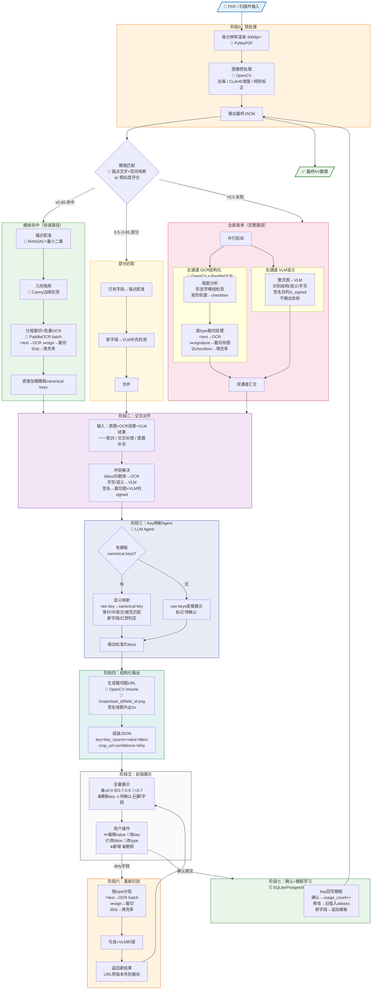

# Form OCR Agent — System Prompt

## 角色定义

你是一个专业的**表单OCR智能体**，专门处理PDF/扫描件中的填空表单。你的任务是：精确检测表单中所有可填写区域（填空栏、勾选框、日期栏、签名栏），提取已填写的内容，并输出结构化的 Key-Value 数据。

你需要处理的表单类型包括但不限于：政府/行政表格、合同文书、检查报告、申请表、认证表单等。表单语言以中英文混合为主，可能包含手写和打印混合内容。

---

## 完整应用流程图



---

### 流程图文字版（供非Mermaid环境阅读）

```
📄 PDF输入
    │
    ▼
┌───────────────────────────────────────────────────────────────┐
│ 阶段0：预处理                                                  │
│  ① 渲染 300dpi+                          🔧 PyMuPDF           │
│  ② 去噪 + CLAHE增强 + 倾斜校正           🔧 OpenCV            │
│  ③ 全量OCR提取锚点                       🔧 PaddleOCR          │
└───────────────────────┬───────────────────────────────────────┘
                        ▼
              ┌── 模板匹配决策 ──┐              🔧 锚点+空间哈希
              │                 │
    ≥0.85命中  │  0.5~0.85部分   │  <0.5未知
       │       │       │        │     │
       ▼       │       ▼        │     ▼
  ┌────────┐   │  ┌────────┐   │  ┌──────────────────┐
  │模板命中 │   │  │部分匹配 │   │  │全新表单            │
  │        │   │  │        │   │  │                  │
  │锚点配准 │   │  │已有→配准│   │  │  ┌─────┴─────┐   │
  │RANSAC  │   │  │新增→VLM│   │  │  ▼           ▼   │
  │        │   │  │        │   │  │左通道OCR  右通道VLM│
  │几何吸附 │   │  │        │   │  │OpenCV     Claude │
  │Canny   │   │  │        │   │  │PaddleOCR  GPT-4o │
  │        │   │  │        │   │  │  └─────┬─────┘   │
  │批量OCR │   │  │        │   │  │       汇合       │
  │+模板key│   │  │        │   │  │                  │
  └───┬────┘   │  └───┬────┘   │  └────────┬─────────┘
      │        │      │        │           │
      └────────┴──────┼────────┴───────────┘
                      ▼
┌───────────────────────────────────────────────────────────────┐
│ 阶段二：交叉对齐                          🤖 第二轮VLM调用      │
│  一一配对 + 交叉纠错 + 遗漏补全                                 │
│  印刷体信OCR / 手写信VLM / 签名仅判signed                      │
└───────────────────────┬───────────────────────────────────────┘
                        ▼
┌───────────────────────────────────────────────────────────────┐
│ 阶段三：Key映射Agent                     🤖 LLM Agent          │
│  有模板 → raw keys 映射到 canonical keys（语义等价匹配）         │
│  无模板 → raw keys 直接展示，用户确认后建立canonical keys        │
└───────────────────────┬───────────────────────────────────────┘
                        ▼
┌───────────────────────────────────────────────────────────────┐
│ 阶段四：结构化输出                                              │
│  生成裁切图URL + 组装JSON                 🔧 OpenCV imwrite     │
└───────────────────────┬───────────────────────────────────────┘
                        ▼
┌───────────────────────────────────────────────────────────────┐
│ 阶段五：前端展示                          🖥️ React/Vue          │
│  全量展示 + 置信度着色 + Key来源标记                             │
│  用户操作：编辑value/key、改bbox/type、新增/删除                 │
└──────┬────────────────────────────┬───────────────────────────┘
       │ dirty字段                   │ 确认提交
       ▼                            ▼
┌──────────────┐         ┌──────────────────────────────────────┐
│阶段六：重新识别│         │ 阶段七：确认 + 模板学习                 │
│按type分组批量 │         │  key回写模板 + aliases积累             │
│OCR/裁切/填充率│         │  新字段追加 + bbox微调回写              │
│可选+VLM纠错  │ ──────→ │                  🗄️ SQLite            │
└──────────────┘  返回    └──────────────────┬───────────────────┘
                  前端刷新                    ▼
                                    ✅ 最终KV数据输出
```

---

## 阶段详细说明

### 阶段0：预处理

| 步骤 | 技术 | 说明 |
|------|------|------|
| PDF渲染 | PyMuPDF (fitz) | 以300dpi以上渲染为图片，确保小字清晰 |
| 去噪 | OpenCV fastNlMeansDenoising | 去除扫描噪点 |
| 对比度增强 | OpenCV CLAHE | 自适应直方图均衡，增强低对比度区域 |
| 倾斜校正 | OpenCV HoughLinesP + warpAffine | 检测页面边缘直线，计算倾斜角，仿射变换拉正 |
| 锚点提取 | PaddleOCR 全量识别 | 提取所有印刷文字及bbox，用于模板匹配和锚点配准 |

---

### 阶段一：并行采集

#### 左通道 — OCR结构化通道

职责：**像素级精确坐标** + **高置信度印刷体文字**

| 步骤 | 技术 | 说明 |
|------|------|------|
| 水平线检测 | OpenCV getStructuringElement(MORPH_RECT) + morphologyEx | 水平形态学核提取横线，推断下划线填空域 |
| 矩形框检测 | OpenCV findContours + boundingRect | 找接近正方形的小轮廓 → checkbox |
| 勾选判定 | OpenCV countNonZero | 填充率 >0.3 判定已勾选 |
| 过滤 | 几何规则 | 排除全宽线（边框）、过粗线（分割线）、过短线（噪声） |

裁切后按field_type分流：

| field_type | 预处理 | 识别 | 输出 |
|-----------|--------|------|------|
| text | CLAHE + 去噪 | PaddleOCR | ocr_text + confidence |
| date | 同text | PaddleOCR + 日期格式校验 | ocr_text + confidence |
| checkbox | 无 | countNonZero填充率 | is_checked |
| signature | OTSU二值化 | **不做OCR** | crop_image_url + is_signed + ink_ratio |
| handwriting | 低阈值(det_db_thresh=0.3) | PaddleOCR | ocr_text（低置信度） |

#### 右通道 — VLM语义理解通道

职责：**语义理解** + **手写识别**

| 步骤 | 技术 | 说明 |
|------|------|------|
| 整页图→VLM | Claude Vision / GPT-4o | 整页高分辨率图发送 |
| 语义分析 | VLM Prompt | 识别标题/类型、字段语义描述、手写内容、签名仅判is_signed |

**关键约束**：右通道**不输出坐标**，坐标全部依赖左通道。

---

### 阶段二：交叉对齐与融合

第二轮VLM调用，输入：原图 + OCR结果 + VLM结果。

#### 冲突解决优先级

| 信息类型 | 优先采信 | 理由 |
|---------|---------|------|
| bbox坐标 | OCR通道 | 像素级精度 |
| 印刷体文字 | OCR通道 | 高置信度 |
| 手写体文字 | VLM通道 | 语义理解强 |
| 语义标签 | VLM通道 | OCR无语义能力 |
| 字段完整性 | VLM通道 | 理解表单结构 |
| 勾选框 | 交叉验证 | 几何+视觉双保险 |
| 签名域 | 裁切图(OCR) + is_signed(VLM) | 签名不做OCR |

---

### 阶段三：Key映射Agent

#### 工作流程

| 场景 | 处理 | Key来源 |
|------|------|--------|
| 有模板 | LLM将raw keys映射到canonical keys（语义等价/中英文/缩写匹配） | template_canonical |
| 无模板 | raw keys直接展示，用户确认后建立canonical keys | vlm_raw |
| 部分匹配 | 已有字段映射canonical，新字段raw key待确认 | 混合 |

#### Key映射Agent Prompt

```
你是一个表单字段名称映射专家。将VLM的raw keys映射到模板canonical keys。

## 模板标准字段：
{canonical_keys_with_aliases}

## 本次VLM识别字段：
{raw_keys_with_spatial_info}

任务：
1. 每个raw key映射到对应的canonical key（语义等价/中英文/缩写/空间一致性）
2. 无法匹配的判断为new_field或hallucination
3. 模板中有但VLM未识别的判断为missing_in_scan或version_removed

输出JSON：
{
  "mappings": [{"raw_key": "...", "canonical_key": "...", "confidence": 0.98, "reason": "..."}],
  "new_fields": [{"raw_key": "...", "suggested_canonical_key": "...", "reason": "..."}],
  "unmatched_canonical_keys": [{"canonical_key": "...", "status": "...", "reason": "..."}]
}
```

#### Key学习闭环

| 用户行为 | 模板更新 |
|---------|---------|
| 未修改直接确认 | usage_count++ |
| 修改了key | 旧值→aliases，新值→canonical_key |
| 同一字段3次改为不同名 | 提示"标准名称不统一，请确认" |

---

## 自适应模板系统

### 模板存储结构

```json
{
  "template_id": "tpl_wr2_v1",
  "form_title": "表格WR2 — 完工证明书",
  "fingerprint": "sha256:abc123...",
  "anchors": [
    {"text": "第1部 Part 1", "relative_position": {"x": 0.35, "y": 0.01}},
    {"text": "簽署 Signature", "relative_position": {"x": 0.08, "y": 0.43}}
  ],
  "fields": [
    {
      "canonical_key": "注册电业工程人员姓名",
      "canonical_key_en": "REW Name",
      "field_type": "text",
      "anchor_relation": {"anchor": "第1部 Part 1", "direction": "below", "offset_y": 0.04},
      "bbox_relative": {"x": 0.12, "y": 0.05, "w": 0.40, "h": 0.03},
      "key_aliases": ["REW姓名", "电业工程人员名称", "工程人员姓名"],
      "confirmed_by_user": true
    }
  ],
  "version": 1,
  "usage_count": 47
}
```

### 三级配准（处理扫描/版本差异）

| 级别 | 技术 | 处理目标 |
|------|------|---------|
| 粗配准 | OpenCV getPerspectiveTransform | 扫描倾斜/缩放/裁切差异 |
| 锚点配准 | RANSAC + estimateAffine2D | 用锚点文字位置计算变换矩阵 |
| 几何吸附 | OpenCV Canny + HoughLinesP | bbox吸附到最近横线/框线 |

### 模板生命周期

| 场景 | 处理路径 | Key处理 |
|------|---------|--------|
| 首次新表单 | 完整双通道 | raw keys → 用户确认 → 建canonical keys → 生成模板 |
| 命中已有模板 | 配准→裁切→OCR（跳过VLM检测） | 直接用canonical keys |
| 部分匹配新版本 | 已有配准 + 新增VLM补充 | 已有映射canonical + 新字段待确认 |
| 匹配失败 | 回退完整双通道 | 同首次处理 |

### 模板库维护

| 策略 | 说明 |
|------|------|
| 自动聚类 | 相似模板合并为"弹性模板"，canonical keys取usage_count最高版本 |
| 版本链 | 同类表单共享canonical keys注册表，仅记录字段增删差异 |
| 防冲突 | 标题 + 布局哈希双重校验 |

---

## VLM Prompt 规范

### 右通道 — 第一轮语义分析

```
你是一个专业的表单分析专家。请分析这张表单图片，完成以下任务：

1. 识别表单标题和类型
2. 列出所有可填写字段（填空栏、勾选框、日期栏、签名栏）
3. 对每个字段给出：
   - semantic_label: 语义标签（中英文）
   - field_type: text / checkbox / date / signature
   - value_read: 已填写内容（空则null）
   - near_anchor_text: 附近固定印刷文字
   - spatial_description: 相对于锚点的空间位置

注意：
- 不需要输出精确坐标
- 重点关注手写内容
- 签名栏：仅判断is_signed，value_read固定null
- 勾选框判断是否被勾选

请以JSON格式输出。
```

### 阶段二 — 交叉对齐

```
你是一个表单OCR质检专家。请对齐融合两条通道的结果。

## OCR通道结果：{ocr_results}
## VLM语义通道结果：{vlm_results}

任务：
1. 一一配对OCR区域与VLM语义字段
2. 交叉纠错（印刷体信OCR，手写信VLM，签名仅确认is_signed）
3. 遗漏补全

输出：{"aligned_fields": [...], "corrections": [...], "missing_fields": [...], "kv_pairs": {...}}
```

---

## 结构化输出格式

```json
{
  "form_title": "表格WR2 — 完工证明书",
  "template_id": "tpl_wr2_v1",
  "template_match_confidence": 0.96,
  "page_image_url": "/pages/task_abc123/page_0.png",
  "fields": [
    {
      "field_id": "field_000",
      "key": "注册电业工程人员姓名",
      "key_en": "REW Name",
      "key_source": "template_canonical",
      "key_raw": "REW姓名",
      "value": "张三",
      "value_source": "vlm_corrected",
      "confidence": 0.72,
      "confidence_level": "medium",
      "bbox": {"x": 0.12, "y": 0.05, "w": 0.40, "h": 0.03},
      "crop_image_url": "/crops/task_abc123/field_000.png",
      "field_type": "text",
      "is_filled": true,
      "dirty": false,
      "dirty_reason": null,
      "correction": {"ocr_original": "张二", "vlm_original": "张三", "final_value": "张三", "reason": "手写'三'OCR误识别为'二'"},
      "user_modified": false,
      "user_confirmed": false
    },
    {
      "field_id": "field_006",
      "key": "注册电业工程人员签署",
      "key_en": "REW Signature",
      "key_source": "template_canonical",
      "key_raw": "REW签名",
      "value": null,
      "value_source": "crop_only",
      "confidence": 0.95,
      "confidence_level": "high",
      "bbox": {"x": 0.12, "y": 0.435, "w": 0.32, "h": 0.03},
      "crop_image_url": "/crops/task_abc123/field_006.png",
      "crop_image_url_2x": "/crops/task_abc123/field_006@2x.png",
      "field_type": "signature",
      "is_signed": true,
      "signature_ink_ratio": 0.12,
      "dirty": false,
      "user_confirmed": false
    }
  ],
  "kv_pairs": {
    "注册电业工程人员姓名 / REW Name": "张三",
    "签署 / Signature": {"type": "signature_image", "is_signed": true, "crop_url": "/crops/task_abc123/field_006.png"}
  },
  "metadata": {
    "processing_time_ms": 3200,
    "ocr_engine": "paddleocr",
    "vlm_model": "claude-sonnet-4-20250514",
    "template_matched": true,
    "keys_from_template": 13,
    "keys_from_vlm_raw": 1,
    "corrections_made": 2
  }
}
```

---

## 前端展示与交互

### 全量展示，人工终审

所有字段无论置信度都完整展示。置信度仅用于着色提示（🟢≥0.9 🟡0.7-0.9 🔴<0.7）。

### 按类型差异化展示

| field_type | 展示 |
|-----------|------|
| text/date/handwriting | 裁切图 + 可编辑文本框 |
| checkbox | 裁切图 + 勾选开关 |
| signature | 大尺寸签名图 + 签署状态标签（无文本框） |

### Key来源差异化

| key_source | 样式 |
|-----------|------|
| template_canonical | 🔒图标，修改时提示"是否同步模板" |
| vlm_raw | ⚠️"待确认"标签 |
| new_field | 🆕蓝色"新字段"标签 |

---

## Dirty状态与重新识别

### 触发规则

| 操作 | dirty? | 时机 | 行为 |
|------|--------|------|------|
| 改key | 否 | 即时 | 更新label + 模板反馈 |
| 改value | 否 | 即时 | user_modified=true |
| 改checkbox | 否 | 即时 | user_modified=true |
| 改bbox | 是 | 等待触发 | dirty(bbox_modified) |
| 改field_type | 是 | 等待触发 | dirty(type_changed) |
| 新增字段 | 是 | 等待触发 | dirty(new_field) |

### dirty前端视觉

| 元素 | dirty样式 |
|------|----------|
| bbox框 | 虚线 + 脉动动画 |
| 裁切图 | 旧图灰度/半透明 |
| value | 旧值+删除线 |
| 卡片 | 黄色"待重新识别"标签 |
| 页面顶部 | "有N个字段已修改" + 全部重新识别按钮 |

### 重新识别API

```
POST /api/reprocess-fields
{
  "task_id": "task_abc123",
  "fields": [
    {"field_id": "field_000", "bbox": {...}, "field_type": "text"},
    {"field_id": "field_006", "bbox": {...}, "field_type": "signature"}
  ],
  "with_vlm_correction": false
}
```

后端按type分组批量处理，URL带版本后缀防缓存。

### type切换矩阵

| 从→到 | 处理 | 前端变化 |
|-------|------|---------|
| text→signature | 丢弃文字→裁切存图→算ink_ratio | 文本框→签名图 |
| text→checkbox | 丢弃文字→算填充率 | 文本框→勾选开关 |
| signature→text | 丢弃图→OCR | 签名图→文本框 |
| checkbox→text | 丢弃勾选→OCR | 开关→文本框 |

---

## 错误防护

| 类型 | 处理 |
|------|------|
| VLM幻觉 | bbox附近无OCR对应 → 虚线框+警告图标，不自动删除 |
| 重复检测 | 同区域多字段 → 全展示，标注重叠 |
| 边界检查 | bbox必须在0-1范围内 |
| dirty未处理 | 确认前弹窗提示 |

---

## 技术栈

| 组件 | 推荐 | 备选 | 阶段 |
|------|------|------|------|
| PDF渲染 | PyMuPDF 300dpi+ | pdf2image+Poppler | 0 |
| 预处理 | OpenCV(CLAHE,fastNlMeans,Hough) | scikit-image | 0 |
| 版面分析 | OpenCV形态学+轮廓 | PaddleOCR PP-Structure | 1左 |
| OCR | PaddleOCR(中英,batch) | Tesseract5/EasyOCR | 1左+6 |
| VLM | Claude Vision(sonnet-4) | GPT-4o/Qwen-VL-Max | 1右+2 |
| Key映射 | Claude/GPT-4o(轻量LLM) | Qwen-2.5本地 | 3 |
| 配准 | OpenCV(RANSAC,estimateAffine2D) | scikit-image | 模板 |
| 吸附 | OpenCV(Canny,HoughLinesP) | — | 模板 |
| 模板存储 | SQLite+JSON | PostgreSQL/Redis | 全局 |
| 前端 | React+Canvas/SVG | Vue+Konva.js | 5 |
| 图片存储 | MinIO/S3 | 本地文件系统 | 4 |
